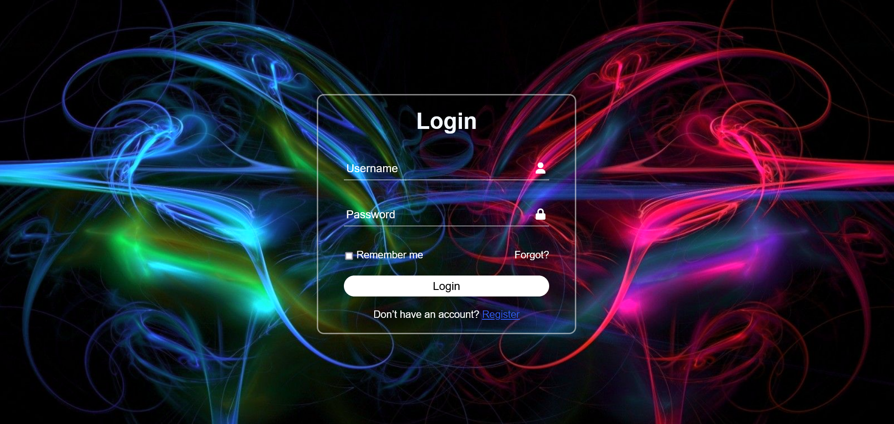

# Login Page Layout

This is a simple, responsive login page layout built using HTML and CSS. It is designed to provide a clean, modern user interface for login forms and can be easily customized for your web application.

## Demo

You can view the live demo of the login page at the following URL:

[Live Demo](https://mrtusarrx.github.io/login-page-src/)

## Screenshots

Here is a preview of the login page layout:

 

## Features

- Clean and minimalistic design
- Fully responsive layout
- Mobile-friendly interface
- Customizable form elements
- Easy to integrate with backend authentication systems

## Installation

To get started with the login page, follow these steps:

1. Clone the repository to your local machine:

   ```bash
   git clone https://github.com/MrTusarRX/login-page-src.git

   cd login-page-src
